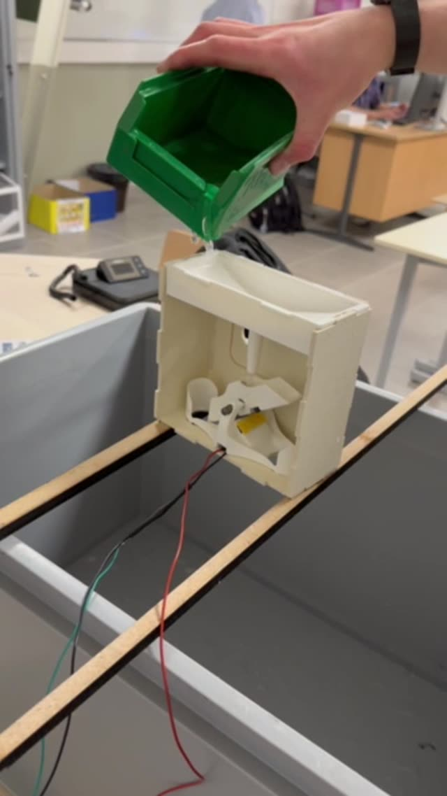
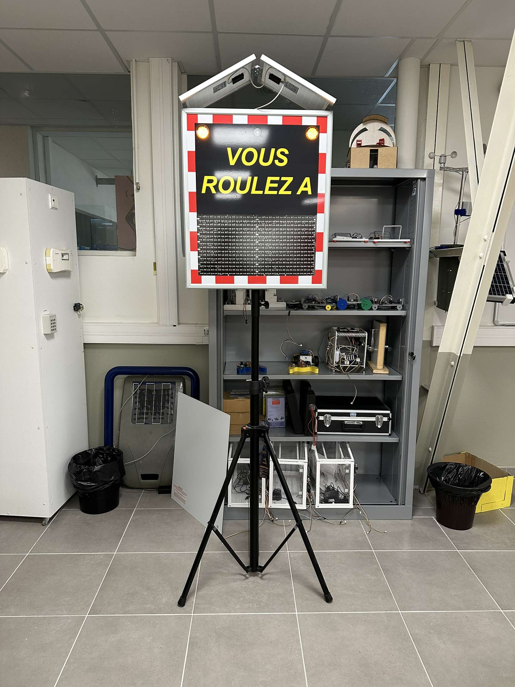
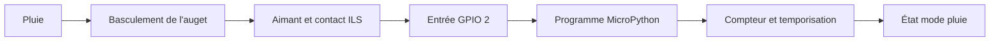
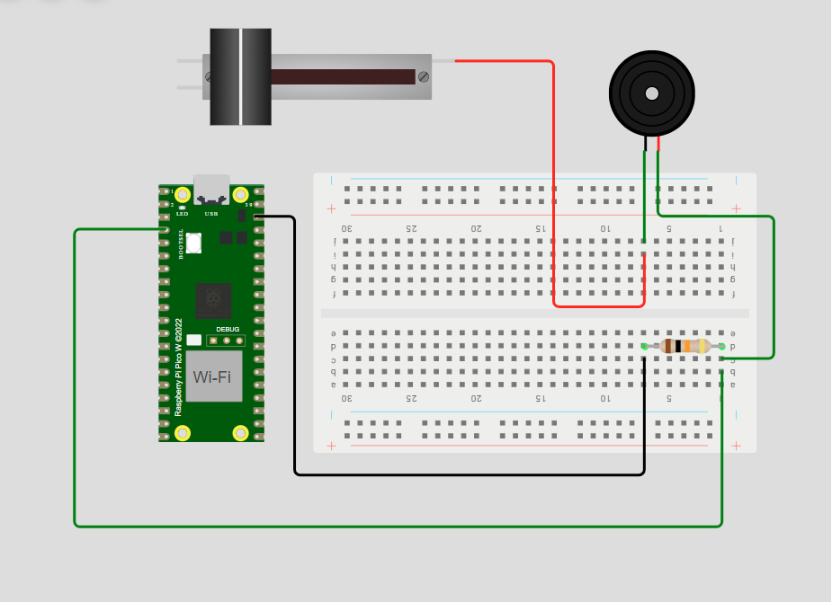

# 🌧️ Radar — détection de pluie par capteur à auget


**Détecter la pluie pour permettre à un radar pédagogique de tenir compte des conditions météorologiques.**

Dans ce projet collectif, j'ai travaillé sur la détection de pluie à l'aide d'un **capteur à auget**, d'un **interrupteur à lames souples (ILS)** et d'un programme **MicroPython**. Le basculement du mécanisme produit un changement d'état électrique, que le programme détecte pour activer et maintenir un état « mode pluie ».

Le projet s'appuie sur un radar pédagogique existant. Mon travail porte sur le module de détection de pluie et son intégration au prototype : lorsqu'un basculement est détecté, le mode pluie adapte la vitesse limite du radar pendant une durée déterminée. Un nouveau basculement relance cette temporisation.

## 🎬 Démonstration

<p align="center">
  <a href="docs/videos/test-auget.mov"></a>
  
</p>

**[Voir la vidéo de l'essai du capteur à auget](docs/videos/test-auget.mov)** — versement d'eau dans le mécanisme et observation des messages du programme. Si le lecteur GitHub ne s'affiche pas, télécharger la vidéo pour la lire localement.

La photo du radar provient du site de présentation réalisé autour du même équipement. Ce site apporte du contexte sur le matériel ; il ne constitue pas une interface de pilotage du capteur.

## ⚙️ Principe de fonctionnement

1. L'eau s'accumule dans le mécanisme à auget.
2. L'auget bascule : l'un des deux aimants placés sous ses extrémités s'approche suffisamment de l'ILS pour le déclencher.
3. Le changement d'état est lu sur une entrée numérique.
4. Le programme incrémente un compteur et active `mode_pluie`.
5. Chaque nouvelle détection renouvelle la temporisation ; sans nouvelle détection, le mode pluie se désactive à son échéance.



Dans le prototype intégré, ce mode adapte la vitesse limite du radar aux conditions de pluie. Les deux fichiers MicroPython documentent la partie acquisition et temporisation ; la liaison avec la commande du radar n'est pas incluse dans ces fichiers.

## 🛠️ Technologies & matériel

| Élément | Rôle |
|---|---|
| **MicroPython** | Lecture de l'entrée, compteur, temporisation et interruption |
| **`machine.Pin`** | Configuration de GPIO 2 et gestion du contact ILS |
| **ILS et deux aimants** | Détection magnétique à chaque basculement de l'auget |
| **Mécanisme à auget** | Conversion de l'accumulation d'eau en mouvement |
| **Raspberry Pi Pico W** | Carte représentée dans le schéma de simulation |
| **Wokwi** | Schéma du montage de simulation |
| **diagrams.net** | Logigramme du fonctionnement |

## 💻 Deux versions du programme

| Version | Acquisition | Traitement |
|---|---|---|
| [ILS avec compteur](src/Radar%20-%20ILS_Compteur_%21.py) | Lecture de l'entrée toutes les 10 ms environ | Détection de chaque changement d'état, compteur et temporisation |
| [Code post-projet](src/Radar%20Code%20Post-Projet.py) | Interruption sur front descendant | Filtrage temporel de 200 ms et traitement de l'événement dans la boucle principale |

Dans les deux fichiers, `durée_pluie = 10 * 60` maintient le mode pluie pendant **10 minutes après la dernière détection**. La vidéo montre un essai avec une temporisation raccourcie.

La première version compte les **changements d'état** du contact : une fermeture puis une ouverture peuvent donc produire deux incréments. La version post-projet se concentre sur les fronts descendants et filtre les événements trop rapprochés. Le compteur affiché doit être interprété selon la version utilisée ; il ne constitue pas, à lui seul, une mesure calibrée de précipitations.

## 👤 Ma contribution

- Programmation de l'acquisition du **capteur ILS** et du compteur associé au mécanisme à auget.
- **Positionnement précis des deux aimants** sous les extrémités de l'auget pour obtenir le déclenchement de l'ILS lors du basculement.
- Gestion du **mode pluie** et de sa temporisation réinitialisée à chaque détection.
- Travail sur les schémas du montage et le **logigramme** du fonctionnement.
- Intégration du capteur au mécanisme et essais avec de l'eau sur le prototype.
- Exploration d'une version utilisant les **interruptions** et un **filtrage anti-rebond**.

Le projet a été mené en équipe, avec des contributions complémentaires en électronique, programmation et conception mécanique. Le radar pédagogique sert de support matériel au prototype.

## 🔌 Schéma & documentation



Le schéma représente le montage de simulation. Les éléments dessinés ne sont pas tous pilotés par les deux programmes : ceux-ci utilisent uniquement l'entrée `Pin(2, Pin.IN)`.

- [Logigramme du capteur à auget — fichier diagrams.net](docs/schemas/capteur-auget.drawio)
- [Vidéo du test avec de l'eau](docs/videos/test-auget.mov)

## 🚀 Exécuter le programme

Les fichiers utilisent **MicroPython** et son module `machine`. Ils sont destinés à une carte compatible, avec le capteur raccordé à **GPIO 2** et un niveau électrique au repos défini par le montage.

1. Préparer une carte avec MicroPython et le montage du capteur ILS.
2. Ouvrir l'un des deux fichiers de `src/` dans un éditeur connecté à la carte, par exemple Thonny.
3. Exécuter le fichier sur la carte et observer la console.
4. Actionner le capteur pour vérifier la détection, l'incrémentation et la réinitialisation de la temporisation.

Un lancement avec Python classique sur ordinateur ne fournit pas le module `machine`. La version post-projet utilise également `time.ticks_ms()` et `time.ticks_diff()`.

## 📁 Organisation

```text
src/                 Programmes MicroPython
docs/images/         Montage, radar et aperçu du test
docs/videos/         Vidéo de démonstration
docs/schemas/        Logigramme du capteur
```

Projet réalisé en **STI2D, spécialité Systèmes d'information et numérique**, dans le cadre d'un prototype collectif de radar adaptatif aux conditions météorologiques.
